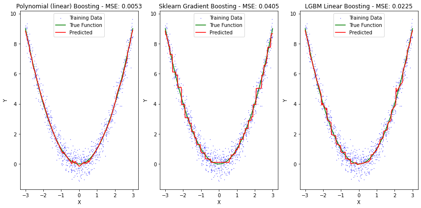
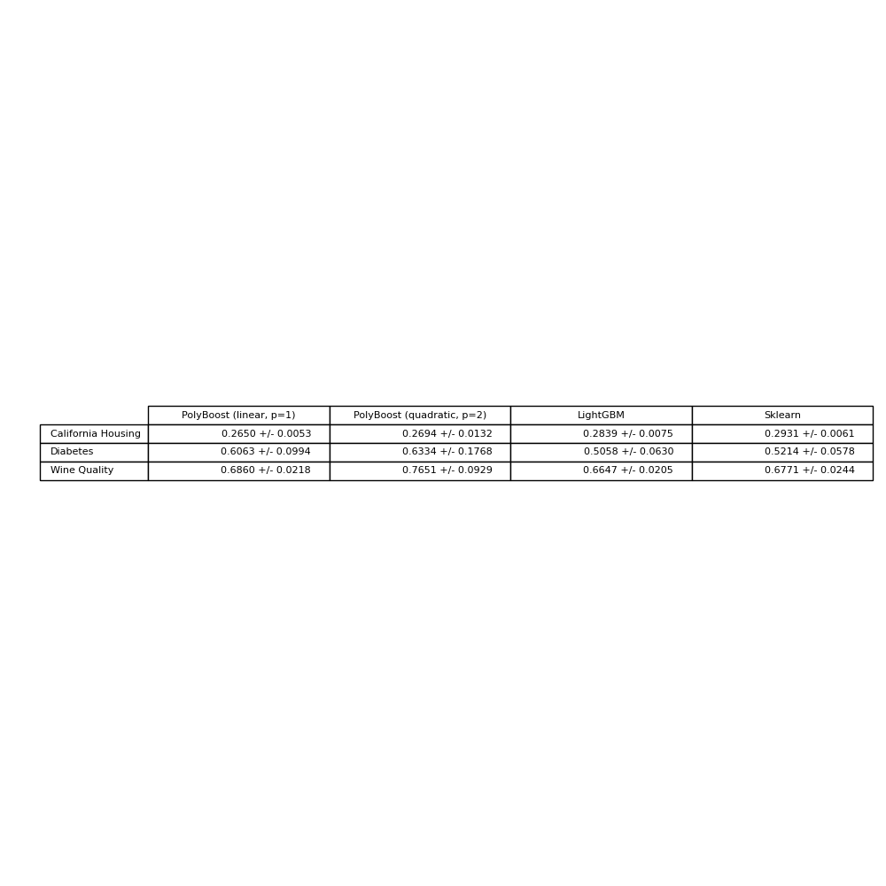

# Polynomial Boosting

[](https://github.com/SaremS/polynomial_boosting/actions/workflows/ctest.yml?query=branch%3Amaster)

Gradient Boosting Regression with polynomial CART stumps. 
Each Boosting component fits a polynomial regression (currently only linear) instead of a flat line.
Finding the best split is still done greadily. 

We use CART stumps (= a single if-else split) as Boosting turns out to be quite powerful and, thus, we can avoid fitting overly expensive deep trees.

The C++ code is tested but lacks sufficient checks for the input data, i.e. you need to make sure that the array sizes for input and output match.
Also the target feature, `y`, needs to be an (N x 1) np.array, rather than an (N,) np.array (vector).

## Installation
This is only tested locally at the moment, but 

```
$ git clone https://github.com/SaremS/polynomial_boosting
$ pip install .
```

should suffice. Make sure you have [Cmake](https://cmake.org/) and a `python-dev` distribution installed

## Example
Polynomial p=1 Boosting VS. sklearn Gradient Boosting on a Quadratic function (hyperparameters were chosen to be similar):



Also, check the [example notebook](https://github.com/SaremS/polynomial_boosting/blob/master/ExampleNotebook.ipynb)

## Benchmarks
Hyperparameters were chosen to make the respective Boosting implementations as similar as possible (e.g. Linear Trees for LightGBM)


